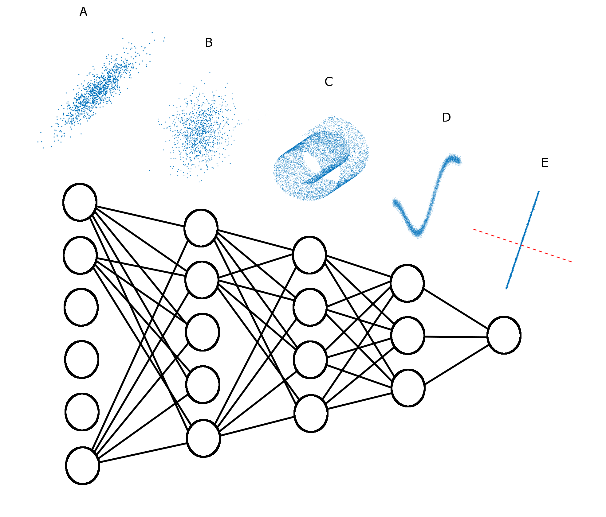
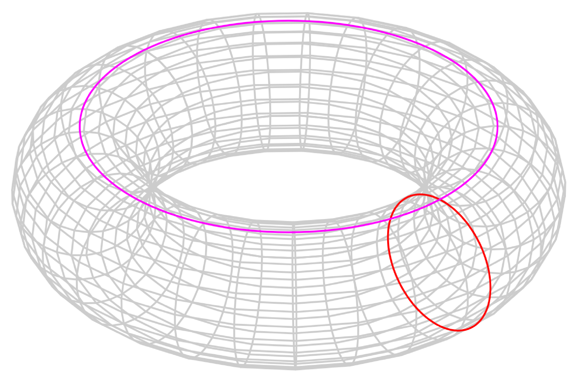
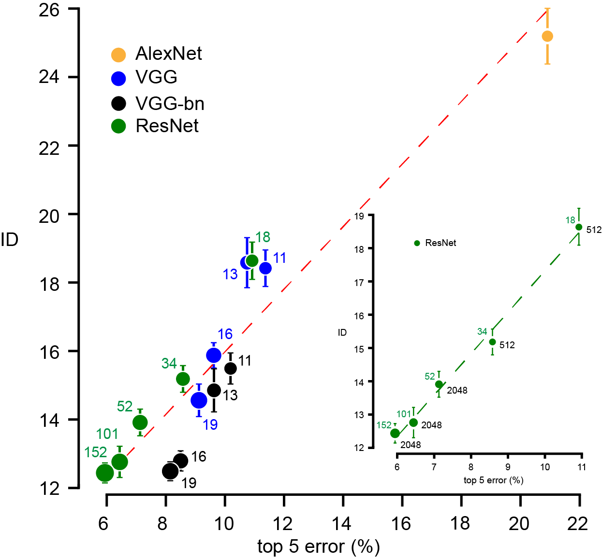
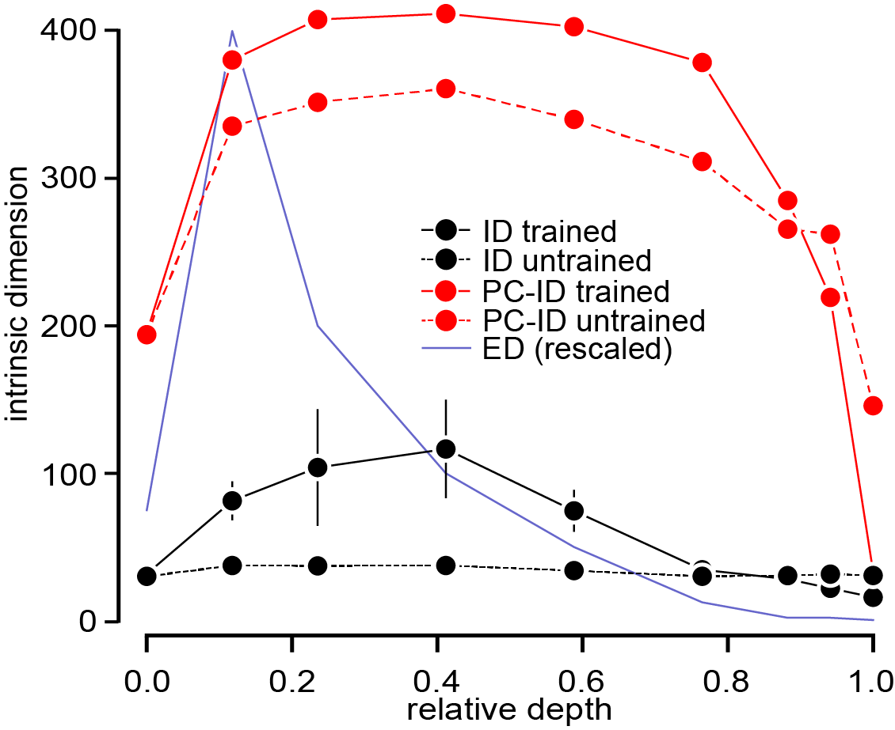
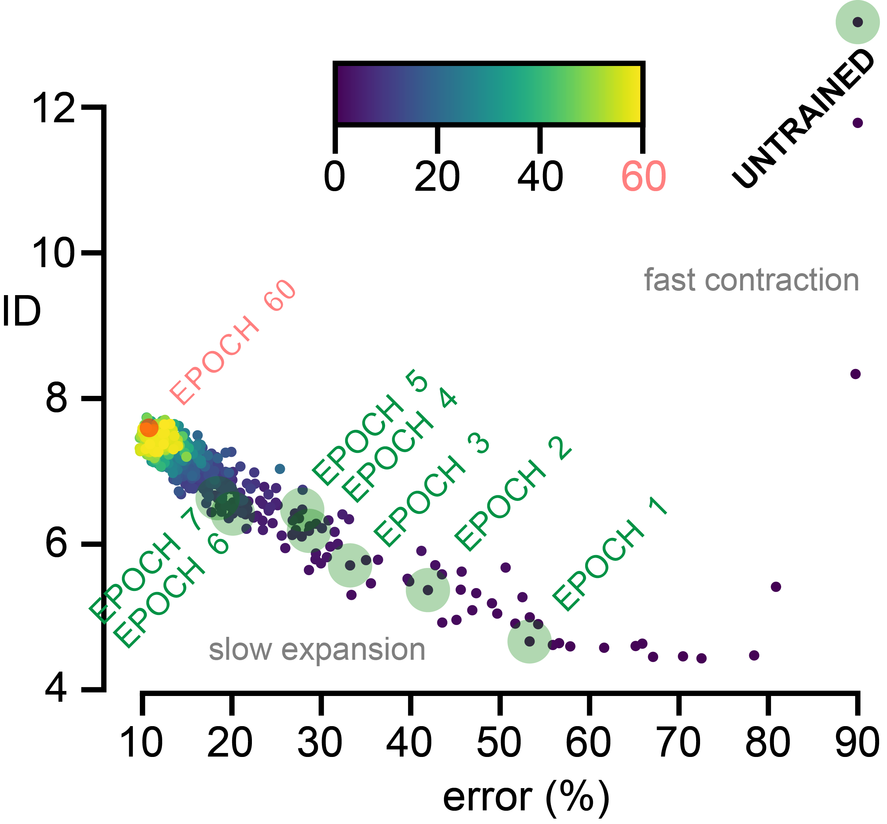

# Intrinsic Dimension of Data Representations in Deep Neural Networks


This is the repository associated to our **NeurIPS 2019** paper

["Intrinsic dimension of data representations in deep neural networks"](https://arxiv.org/abs/1905.12784)

**Paper Authors**

Alessio Ansuini (1),  Alessandro Laio (1),  Jakob H. Macke (2),  Davide Zoccolan (1)

(1) International School for Advanced Studies (SISSA)  https://www.sissa.it/ 

(2) Technical University of Munich (TUM)  https://www.tum.de/


*Alessio Ansuini wrote the following contents: he is the only one to blame for any error in these **still under construction** github pages.*





## Contents

We provide

- a **brief outline** of our work, on this page
- detailed instructions for **reproducibility** of our results [here](./REPRODUCIBILITY.md)
- **extra materials** (videos, slides, etc.) just below

We will provide in future weeks/months a few **tutorials** pointing to possible extensions and open problems.

## Extras

- Alessio Ansuini's [**poster**](https://drive.google.com/open?id=14SgF5BSVeAwEYo52gDH4v0ZgkzR_NpTa) at NeurIPS 

- [Davide Zoccolan](https://people.sissa.it/~zoccolan/VisionLab/Home.html)'s interdisciplinary [**seminar**](https://www.youtube.com/watch?v=nO13-AHit6E) - at the interface between Neuroscience and Deep Learning - given 
at the ICTP Workshop on Science of Data Science | (smr 3283).


## Outline of our work

**Prologue**

Datasets can be very high-dimensional. In images, each pixel counts for one dimension 
(three if coloured), so high-resolution images typically have dimensionality
larger than 1,000,000. 

Countless examples could be made from the fields of biology (genomics, epigenomics), 
particle physics, et cetera.

The **embedding dimension** (ED) is the number of *features* in the data
(number of pixels, number of genes expressed in microarrays, etc.) and 
this is usually the number that counts when data are stored and transmitted
(unless we compress it).

The **intrinsic dimension** (ID) is, informally,

*the minimal number of parameters needed to describe the data*.

The ID could be much lower than the ED, depending on how much structure and 
redundancy is present in the original representation.

Let us make an example: a torus in 3 dimensions



When we use the euclidean coordinates we can specify 
a point on the torus giving three numbers: ED = 3. 
But in such a description we are not taking into account 
the structure of this surface.
We are not even taking into account that *it's a surface*.
It turns out that, in fact, the ID = 2 in this case,
because we need only two coordinates (one angle for each 
generating circle) to specify uniquely a point on its surface.

Now let us imagine a dataset composed of a number of points
lying close to the torical surface, with some small fluctuations due to 
the presence of noise.
What we require from an algorithm that estimates the intrinsic 
dimensionality of this dataset is a value close to two, also
if the *local* dimensionality of the noise perturbation (almost by
definition of noise) is three.


When we are faced with a new dataset, very often we do not much about the 
process that generated it. (In the case of the torus, for example, we
could ignore the fact that, in order to generate these data, it was
enough to choose random pairs of angles with some probability distribution,
transform angles in euclidean coordinates, and then add a small random
perturbation to each of these points.)

So, in general, it would be helpful, when exploring data, to know
what is the intrinsic dimensionality to start with.
It would be helpful for many purposes: compression, density estimation etc.

In our work we investigated the intrinsic dimensionality of
representations in the hidden layers of deep neural networks.

The hope is to use the ID of these representations - in synergy with other approaches - 
in elucidating the inner workings of DNNs. We also hope that the method of estimation used in
this paper will be helpful in many other problems in deep learning and the analysis 
of datasets in general.

**Main**

It is well known that DNNs - in particular convolutional networks (CNN) - transform their input 
from the original space (pixels, sounds, etc.) to a progressively abstract form, 
that support classification and, eventually, downstream actions.  

We follow the evolution of representations along the layers of CNNs focusing on its 
intrinsic dimension, using the method of estimation described in a recent paper by [Facco et al.]( https://www.nature.com/articles/s41598-017-11873-y).

Our main findings are:

- the ID profile, across a relevant number of state-of-the-art (pretrained) CNNs follows a curved shape that we informally nicknamed the "hunchback"

  (to compare many different architectures we plotted the ID vs. a *relative depth*, which is the number of non-trivial transformations that the network performs on the input (convolutional and fully-connected layers' operations) divided by the total number of these transformations before the output)

  


- the ID in the last hidden layer (for the same set of networks) is predictive of its generalization performance

  (this result holds across and within architecture classes, see for example the inset for ResNets)

  



- representations in hidden layers lie typically on *curved manifolds*.

  This result may not be surprising for the input and intermediate layers: it is commonly accepted that, due to the complex constraints that shape categories, object manifolds are typically twisted and curved.

  But we observed that also representations in the last hidden layer are curved, and this indicates that a flattening of data manifolds may not be a general computational goal that deep networks strive to achieve: progressive reduction of the ID, rather than gradual flattening, seems to be the key to achieving linearly separable representations.  

  A linear approach to dimensionality estimation based on PCA was unable to capture the actual dimensionality of representations. For example, we did not found clear eigenvalues gaps in the correlation matrix (normalized or not) and this is for itself an indication of curvature (but more evidence is provided in the paper, see for example Fig. 5 panel B)

  A linear estimate based on PCA that we looked at is the number of eigenvectors that capture the 90% of variance in the data; we called this dimensionality estimate PC-ID.

  What we found is that this PCA-based measure:
  - gives much higher values than the ID (typically one or two orders of magnitude larger)
  - **is not able to distinguish qualitatively between trained and untrained networks**. 
  
  On the contrary, our ID estimate shows that for untrained networks the ID is substantially flat, therefore the hunchback shapes we found in trained networks are a genuine effect of training.

<!---
We observe that this is consistent with the fact that random linear transformations (neglecting the effect of non-linear activation functions) in high-dimensional space are close to orthogonal and thus it will tend to leave the intrinsic dimension of a low-dimensional manifolds, embedded in the source space, unchanged.
--->

 

**Further results: dynamics**

We performed further experiments on the dynamics of the ID. These line of research is very important, in particular for the development of unsupervised approaches (see for example [Ma et al.](https://arxiv.org/abs/1806.02612) and [Gong et al.](https://arxiv.org/abs/1803.09672)).
Anyway, from the evidence we collected and from the results we found in the literature we are not able to draw systematic conclusions. 
We performed these experiments on a VGG-16 network trained on CIFAR-10; the architecture and the optimization procedure used for these experiments is taken from https://github.com/kuangliu/pytorch-cifar.

Our main observations are:

- during training different layers show different dynamics.

  This is already clear from the figure above, by comparing the ID of untrained and trained VGG-16 (respectively, black dashed and continuous line). 

  In new experiments, described in the Supplementary Materials, we also found that 1) the final layers compress representations 2) the initial and intermediate layers expand it.

  In the following figure, we can easily appreciate these findings by looking at how the ID in the untrained network (thick black line), gradually transforms into the ID profile of the fully trained network (light yellow).
  


Taking a closer look at the early phases of training (now focusing only on the last hidden layer) we also found that, after a first compression phase (lasting approximately a half-epoch) the ID slowly expanded and stabilized at a higher value. This *change of regime* (from compression to expansion) is not accompanied in this case to the onset of overfitting, as it was observed in [Ma et al.](https://arxiv.org/abs/1806.02612) that used *local* measures of intrinsic dimension. It is important, for such comparisons, to remember that our ID estimate is a *global* one. 

Overall, we think that the dynamics of the ID is not yet completely understood, perhaps depending on the architectures, datasets and optimization procedures.




<!--### Tutorials (work in progress)
We provide the following tutorials:
- Extraction and ID computation on a small convolutional network (MNIST)
- Multi-scale analysis (block-analysis)
- Extraction and ID computation in a VGG-16 (ImageNet)
- Dynamics of the ID in VGG-16 (CIFAR-10) 
-->
   
  ## References
  
  If you found this useful please consider citing the following paper
  
  ```
  @article{ansuini2019intrinsic,
  title={Intrinsic dimension of data representations in deep neural networks},
  author={Ansuini, Alessio and Laio, Alessandro and Macke, Jakob H and Zoccolan, Davide},
  journal={arXiv preprint arXiv:1905.12784},
  year={2019}
  }
  ```
